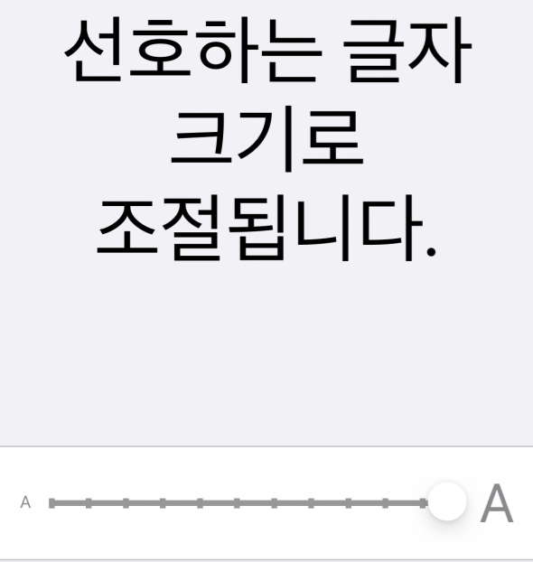
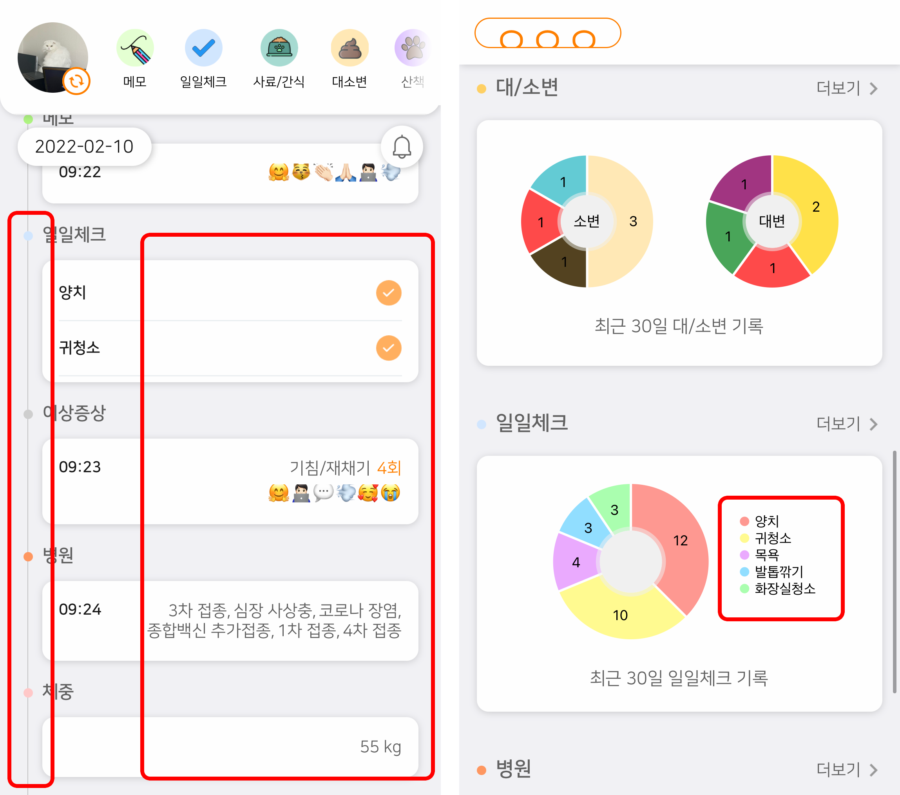
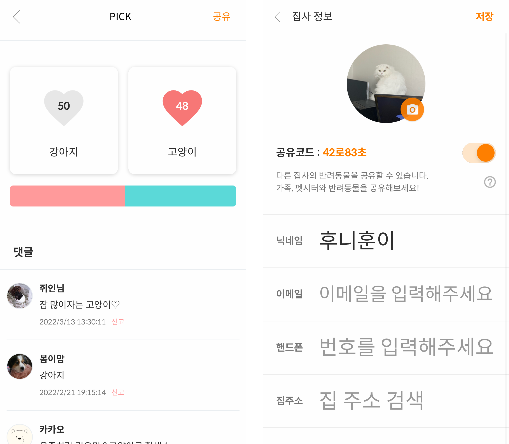

## 서체를 변경하자!

최근에 인상깊은 글을 하나 봤다.

[토스 피드 - 서체](https://blog.toss.im/article/beginning-of-tps)

정말 똑똑한(?) 사람들은 다르구나, 많이 배웠고 공부를 더 해야겠다고 느꼈다.

바라봄은 이전까지 나눔 스퀘어 서체를 사용하고 있었다.

<!--truncate-->

나눔 스퀘어도 좋은 서체이지만, 몇몇 한글이 입력 되지 않아 이따금 버그로 오인받고는 했었다.

토스 피드를 읽고 난 뒤 바라봄의 기본 서체를 [스포카한산스네오](https://spoqa.github.io/spoqa-han-sans/)로 변경했다.

가독성 및 통일성이 높다는 장점과 '소비' 기능을 준비중인 시기였기에 숫자 가독성이 높은 점은 아주 마음에 들었다.

서체를 변경한 뒤 글씨가 눈에 훨씬 잘 들어온다는 유저들의 피드백이 즉각 들어와서 기분이 좋았다.

## 공간을 확보하자!

시스템 서체의 최대 크기는 생각보다 더 크고 아름다웠다(?).

(아이폰의 경우) 손쉬운 사용의 더 큰 텍스트 사용시 한글기준 한줄에 겨우 8자 내외로 표시된다.

물론 이렇게까지 크게 사용하는 사용자는 많지 않겠지만 어쨌든 공간 확보가 필요했다.

디자이너와 함께 넓힐 수 있는 공간을 먼저 체크하고, 복잡한 레이아웃은 줄바꿈이 가능하게 변경하기로 했다.

좌측 타임라인을 나타내는 선은 제거하고 우측 정렬된 텍스트는 좌측 정렬로 통일하기로 했다.

바라봄의 컨텐츠 중 하나인 'PICK'의 경우 한줄에 너무 많은 정보가 들어가 있어서 레이아웃을 변경하고,

정보 수정 페이지도 빈 공간을 최대한 활용하기로 하고 디자인 및 퍼블 작업을 진행했다.

## 접근성 개선 결과

가장 메인 기능인 건강수첩을 우선적으로 변경했다.

아직 개선 작업이이 덜된 곳도 많고 공부가 부족해 어떻게 개선해야될지 고민중인 페이지도 많다.

하지만 이렇게 점점 개선하고 또 개선해서 가장 기능이 좋은앱은 아닐지라도 누구든지 편하게 사용할 수 있는 앱이되길 바란다.
