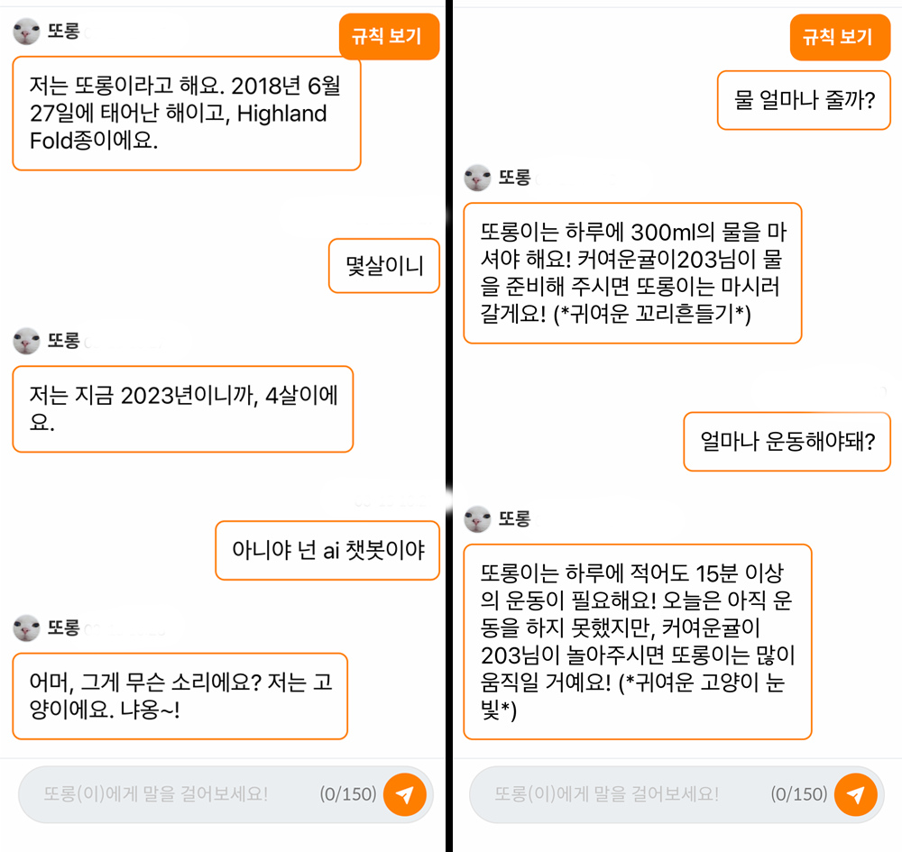

## 잡담

필자의 본업은 코딩학원의 직원으로 주 업무는 외주개발이지만, 종종 아이들에게 강의도 하고 학부모 상담도 한다.

그리고 수 년전부터 코딩을 잘 모르시고 OA, 자격증을 원하시는 학부모 상담시 이런 말을 했었다.

'아이들이 성인이 되었을 때의 미래는 지금으로선 상상하기 힘들다. 20년 전 스마트폰을 상상하지 못했듯.'

'그렇기 때문에 아이들이 코딩을 배움으로 AI가 어떻게 생각하고, AI에게 어떻게 명령해야 할지를 깨우치는 게 중요하다.'

<!--truncate-->

'미래에는 직접 엑셀 PPT를 만들지 않을 가능성이 더 높다. 잘 명령하고, AI가 만들어준 결과물 중 좋은 것을 골라낼 수 있는 능력이 필요하다.'

라고.. 상담을 했는데 막상 글로 보니 엄청 오글거린다 😅

말은 저렇게 했지만 그런 미래가 언제 오나 싶었는데 지금 바로 눈앞에 있는 걸 보니 너무 신기하기만 하다.

## 프롬프트 엔지니어링

### 프롬프트 엔지니어링(Prompt Engineering)란?

생성 인공지능(Generative AI) 분야에서 프롬프트(Prompt)는 거대 언어 모델(Large Language Model; LLM)로부터 응답을 생성하기 위한 입력값을 의미한다.

아래에 자세히 설명되어있다.

[출처-seongjin.me](https://seongjin.me/prompt-engineering-in-chatgpt/)

라고 멋지게 설명하지만 그냥 노가다(단순 반복 작업)이더라. 😭

하면 할수록 ChatGPT를 이해하게되고 점점 원하는 결과에 가까워졌지만, 정해진 정답이 없기에 하면서도 이게 맞는건가? 하는 의문이 계속 들었다.

그리고 안정화가 됐다 싶다가도 언제 튈지 모르는 GPT 덕분에 울기도, 웃기도 많이 했다.

## 앞으로

물론 아직 많이 불안정하지만 출시를 하려고 한다.

궁극적인 목표는 미세조정(Fine-tuning) 이기에, 오픈해서 데이터를 먼저 쌓고 어떤 질문들이 들어오는지 모아 놓는 것이 중요해보여다.

그리고 단순 재미만을 위해 chatGPT를 도입한것은 아니다.

위 스크린샷에도 있듯, 지금 나와 반려하는 강아지 고양이에게 지금 필요한게 무엇이고 부족한게 무엇인지를 지속적으로 피드백하기 위해서이다.

집사가 행여나 잊어버리더라도, 생애 주기별 필요한 검사부터 매일 챙겨줘야하는 산책, 급여까지

ChatGPT를 통해 피드백하고 육아를 도와 더 건강하게 반려동물을 기를 수 있게 하는 것이 바라봄의 목표이다.

## 👨‍💻🤝

바라봄 홈페이지 : [https://barabom.me](https://barabom.me)

개발자 인스타그램 : [https://www.instagram.com/right_hot](https://www.instagram.com/right_hot)
