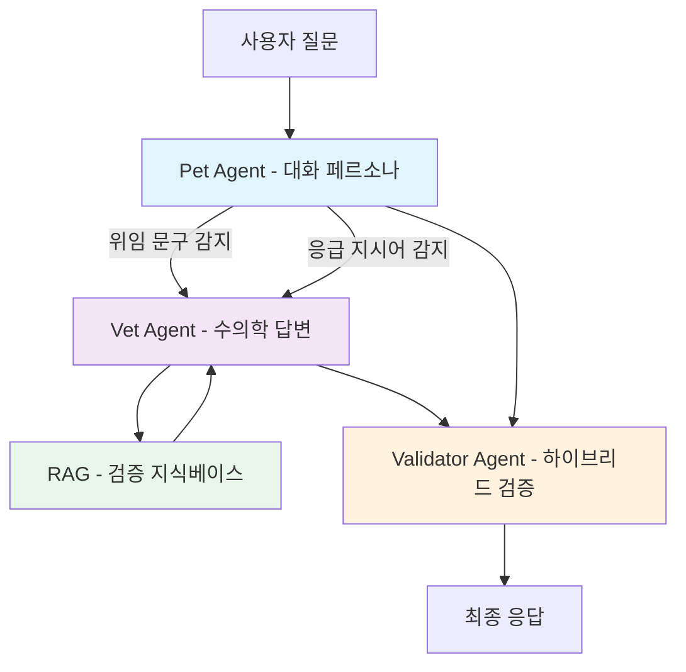
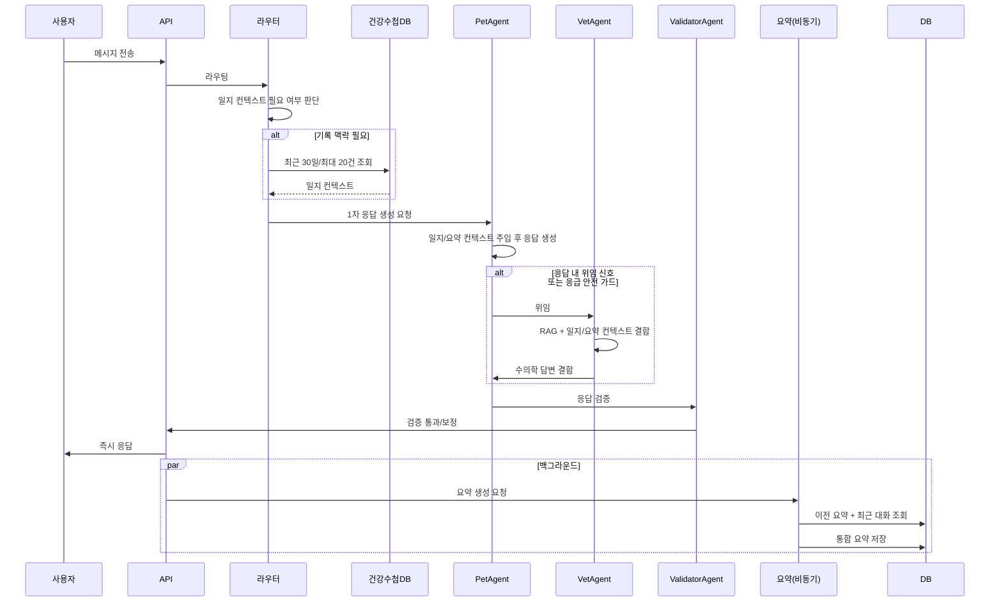

## 잡담

또롱이(우리집 고양이)와 대화하면 어떨까?! 라는 단순한 아이디어로 반려동물 채팅 MVP를 만든 지 벌써 3년이 지났다. ([ChatGPT 활용해 반려동물 대화 기능 만들기](/blog/chat-gpt))

AI Agent도 없던 시절이라, 반려동물 채팅 기능까지 유지보수하기는 1인 개발자로서 쉽지 않았다.

그렇게 얼마 지나지 않아 당시 연결해둔 LLM API가 종료되었고, 단일 문자열 프롬프트에 강하게 의존하던 구조는 LLM API 변경에도 쉽게 망가져버렸다.

그렇게 방치된 기능으로 2년이 흘렀다.

<!--truncate-->

### 다시 만들어보자.

서비스 문의 중에 지금도 잊혀지지 않는 메시지가 있다.

> 아이와 1:1대화 더 많이 할수있게 부탁드려요. 어제 아이를 떠나보내고 슬픔에 빠져 절망스러웠는데 해당어플의 대화기능을 통해 많이 위로받았습니다. 이런 좋은기능 만들어주셔서 정말정말 감사해요. 생각지도 못한곳에서 보물을 발견한 기분이에요. 너무너무 감사합니다.

... 계속 유지보수하지 못해 죄송했다.

하지만 이번에는 AI Agent라는 든든한 지원군이 있으니, 바이브 코딩을 곁들여 다시 만들어보기로 했다.

## 단일 프롬프트에서 오케스트레이션으로

새로운 바라봄 챗은 **3-Agent 오케스트레이션**을 중심으로 동작한다.

- `PetAgent`: 보호자와 자연스럽게 대화하는 페르소나 레이어
- `VetAgent`: 실제 수의학 판단/설명 생성 레이어
- `ValidatorAgent`: 응답 안전성 점검 레이어

여기서 중요한 포인트는 역할 분리다. 의학 답변 생성 책임을 VetAgent로 분리해 정확성과 책임 경계를 명확히 했다.

## 라우팅 핵심: "질문"이 아니라 "응답"을 본다

이번 구조에서 가장 크게 달라진 점은 **응답 기반 위임**이다.

기존처럼 질문 키워드만 보고 "의학 질문인가?"라고 단정하지 않는다. 먼저 PetAgent가 응답을 만들고, 그 응답 안의 위임 신호를 기준으로 Vet 위임 여부를 결정한다.

여기에 안전 가드를 추가했다.

- Pet 응답에 "수의사 선생님", "모르는 질문" 같은 위임 문구가 있으면 Vet 위임
- Pet 응답에 "응급 신고", "즉시 전화" 같은 지시가 포함되면 안전 fallback으로 Vet 위임 강제
- 짧은 후속 질문("시간은?", "그때는?")도 직전 원문/요약을 함께 읽어 해석
- "내가 방금 뭐라고 했지?" 같은 복기 질문은 직전 사용자 발화를 우선 참조

즉, 라우팅의 기준이 질문 단어 자체보다 **생성된 응답과 안전 신호**가 되었다.

## 검증 정책: 규칙 + LLM 하이브리드

ValidatorAgent는 두 단계로 동작한다.

1. 규칙 기반 검증: 빈 응답, 금지어 등 즉시 판별 가능한 조건 차단
2. LLM 기반 검증: 의미적 안전성과 자연스러움 점검

여기서 중요한 건 타임아웃이 나더라도 "응답 없음"으로 끝내지 않는다는 점이다. 핵심 답변이나 재시도 안내를 포함한 fallback으로 사용자 경험을 지킨다.

## RAG와 요약: 정확도와 맥락을 동시에

### RAG

RAG는 Merck, AVMA, AAHA, WSAVA 같은 권위 있는 기관 자료를 중심으로 구성했다. 참고 기준 역시 peer-reviewed 문헌과 공신력 있는 협회 출처로 제한했다.

#### 검색 판단 방식

현재 바라봄 RAG의 검색 판단은 단순하다.

- 사용자 질문을 임베딩 벡터로 변환
- 벡터 스토어에서 유사도 기준으로 상위 `topK` 문서 조각 검색
- VetAgent 경로에서는 기본적으로 `topK=3`을 사용
- 검색된 조각을 시스템 프롬프트에 그대로 주입해 답변 생성

즉, 지금 단계의 기준은 "질문과 의미적으로 가까운 문서 조각 3개"라고 보면 된다.

조금 더 풀어쓰면, 현재 파이프라인은 아래 순서로 흘러간다.

1. 질문 임베딩 생성: "강아지가 토를 해요" 같은 사용자 문장을 숫자 벡터로 변환한다.
2. 최근접 이웃 검색: 벡터 공간에서 가장 가까운 조각을 `topK`만큼 뽑는다.
3. 컨텍스트 직렬화: 검색된 조각을 문서 제목+본문 형태로 이어 붙인다.
4. 프롬프트 주입: 이어 붙인 컨텍스트를 시스템 프롬프트에 넣고 LLM에 전달한다.
5. 답변 생성: LLM은 전달받은 문맥과 자체 일반 지식을 함께 사용해 응답한다.

중요한 포인트는 LLM이 지식베이스를 "직접 조회"하는 구조가 아니라는 점이다. 검색은 애플리케이션 레이어가 먼저 수행하고, LLM은 검색 결과를 입력으로 받아 답을 만든다.

#### 한계점

지식베이스 문서가 늘어나면 다음 문제가 생길 수 있다.

1. 상위 3개 안에 핵심 근거가 들어오지 못하고, 비슷하지만 덜 중요한 조각이 포함되는 문제
2. 스킬 분류를 하더라도 검색 단계에서 강한 메타데이터 필터링이 없어 잡음이 섞일 수 있는 문제
3. 1차 검색 결과를 재정렬(re-rank)하는 단계가 없어 최종 근거 품질이 검색 순위에 크게 의존하는 문제

실제 운영 관점에서 보면 이런 식으로 나타난다.

- 질문이 조금 모호하면, 핵심 근거 대신 "주제만 비슷한" 조각이 top-3를 차지할 수 있다.
- 응급/비응급 경계 질문에서, 안전 문구는 맞지만 디테일이 약한 답변이 나올 수 있다.
- 문서가 많아질수록 동일 주제의 중복 청크가 늘어나, 서로 비슷한 근거만 반복 주입될 수 있다.

결국 현재 구조의 병목은 "검색 이후 품질 보정 단계가 얕다"는 데 있다.

- 1차 검색: 빠르고 단순
- 2차 정제: 아직 제한적

그래서 품질 튜닝의 핵심은 topK를 무작정 늘리는 것이 아니라, **노이즈를 줄이면서 근거 품질을 높이는 후처리**다.

그래서 현재 구조는 "빠르고 단순한 초기형 RAG"로는 충분히 실용적이지만, 문서량이 커질수록 **정밀도/재현율 튜닝**이 필요해진다.

향후에는 아래 순서로 개선하려고 한다.

1. 하이브리드 검색(BM25+벡터): 의미 유사도와 키워드 정합을 함께 반영
2. 메타데이터 필터 강화: 스킬/문서군/버전 범위를 먼저 좁혀 검색 노이즈 축소
3. 동적 topK: 질문 난이도와 점수 분포에 따라 3 고정이 아닌 가변 검색
4. 재정렬(rerank): 1차 후보를 다시 평가해 "정말 답변에 필요한 근거" 중심으로 최종 선택

요약하면, 현재는 "빠르게 동작하는 1단계 RAG"이고, 다음 단계는 "대규모 문서에서도 흔들리지 않는 2단계 RAG"으로 개선할 것 이다.

#### 현재 상태 (검색 판단 방식)

현재 바라봄 RAG의 검색 판단은 비교적 단순하고 명확하다.

- 사용자 질문을 임베딩 벡터로 변환
- 벡터 스토어에서 유사도 기준으로 상위 `topK` 문서 조각 검색
- VetAgent 경로에서는 기본적으로 `topK=3`을 사용
- 검색된 조각을 시스템 프롬프트에 그대로 주입해 답변 생성

즉, 지금 단계의 기준은 "질문과 의미적으로 가까운 문서 조각 3개"라고 보면 된다.

조금 더 풀어쓰면, 현재 파이프라인은 아래 순서로 흘러간다.

1. 질문 임베딩 생성: "강아지가 토를 해요" 같은 사용자 문장을 숫자 벡터로 변환한다.
2. 최근접 이웃 검색: 벡터 공간에서 가장 가까운 조각을 `topK`만큼 뽑는다.
3. 컨텍스트 직렬화: 검색된 조각을 문서 제목+본문 형태로 이어 붙인다.
4. 프롬프트 주입: 이어 붙인 컨텍스트를 시스템 프롬프트에 넣고 LLM에 전달한다.
5. 답변 생성: LLM은 전달받은 문맥과 자체 일반 지식을 함께 사용해 응답한다.

중요한 포인트는, LLM이 지식베이스를 "직접 조회"하는 구조가 아니라는 점이다. 검색은 애플리케이션 레이어가 먼저 수행하고, LLM은 검색 결과를 입력으로 받아 답을 만든다.

또 현재는 성능/안정성을 우선해 검색 로직이 단순하다. 초기 서비스 단계에서는 이 단순함이 꽤 큰 장점이었다.

- 추론 경로가 명확해서 디버깅이 쉽고
- 응답 속도 예측이 상대적으로 안정적이며
- 프롬프트 토큰 비용이 과도하게 튀지 않는다

다만 이 장점은 데이터가 커질수록 아래 한계와 맞닿는다.

#### 한계점 (데이터가 많아질수록 드러나는 부분)

지식베이스 문서가 늘어나면 다음 문제가 생길 수 있다.

1. 상위 3개 안에 핵심 근거가 못 들어오고, 비슷하지만 덜 중요한 조각이 들어오는 문제
2. 스킬 분류는 하더라도 검색 단계에서 강한 메타데이터 필터링이 없어서 잡음이 섞일 수 있는 문제
3. 1차 검색 결과를 재정렬(re-rank)하는 단계가 없어 최종 근거 품질이 검색 순위에 크게 의존하는 문제

실제 운영 관점에서 보면 이런 식으로 나타난다.

- 질문이 조금 모호하면, 핵심 근거 대신 "주제만 비슷한" 조각이 top-3를 차지할 수 있다.
- 응급/비응급 경계 질문에서, 안전 문구는 맞지만 디테일이 약한 답변이 나올 수 있다.
- 문서가 많아질수록 동일 주제의 중복 청크가 늘어나, 서로 비슷한 근거만 반복 주입될 수 있다.

결국 현재 구조의 병목은 "검색 이후 품질 보정 단계가 얕다"는 데 있다.

- 1차 검색: 빠르고 단순
- 2차 정제: 아직 제한적

그래서 품질 튜닝의 핵심은 topK를 무작정 늘리는 것이 아니라, **노이즈를 줄이면서 근거 품질을 높이는 후처리**다.

그래서 현재 구조는 "빠르고 단순한 초기형 RAG"로는 충분히 실용적이지만, 문서량이 커질수록 **정밀도/재현율 튜닝**이 필요해진다.

향후에는 아래 순서로 개선하려고 한다.

1. 하이브리드 검색(BM25+벡터): 의미 유사도와 키워드 정합을 함께 반영
2. 메타데이터 필터 강화: 스킬/문서군/버전 범위를 먼저 좁혀 검색 노이즈 축소
3. 동적 topK: 질문 난이도와 점수 분포에 따라 3 고정이 아닌 가변 검색
4. 재정렬(rerank): 1차 후보를 다시 평가해 "정말 답변에 필요한 근거" 중심으로 최종 선택

요약하면, 현재는 "빠르게 잘 동작하는 1단계 RAG"이고, 다음 단계는 "대규모 문서에서도 흔들리지 않는 2단계 RAG"를 만드는 과정이다.

### 건강수첩 DB 컨텍스트 (실제 기록 기반)

건강수첩 데이터는 모든 질문에서 무조건 조회하지 않는다. 현재 메시지, 직전 대화, 요약을 함께 보고 기록 맥락이 필요할 때만 조회한다. 조회 범위도 `건강수첩 DB`의 **최근 30일, 최대 20건, 최신순**으로 제한해 컨텍스트를 정리한다. 이렇게 정리된 일지 정보는 Pet/Vet 프롬프트에 함께 들어가 "최근 어떤 증상이 있었는지" 같은 질문에 **실제 기록**을 반영한다.

### Conversation Summary (비동기 롤링 요약)

요약은 사용자 응답 생성과 분리해 비동기 백그라운드에서 처리한다. 이전 요약과 최근 5개 실제 메시지를 합쳐 통합 요약을 만들고, 사용자 턴 기준 3턴마다 1회만 생성해 과도한 요약 호출도 막았다.

덕분에 긴 대화에서도 맥락이 끊기지 않고, 전체 대화 원문을 매번 넣지 않아 토큰 비용도 안정적으로 관리된다.

## 요청 처리 흐름

지속 대화 API와 단발 질문 API는 동일한 원칙을 공유한다. 사용자에게는 즉시 응답을 반환하고, 무거운 맥락 정리는 뒤에서 비동기로 처리한다.

## 마무리

확실히 AI가 발전하면서 서비스 개발도 한층 쉬워진 것 같지만, 어느 글에서 **AI의 역할은 90%까지**라고 하더라.

나머지 10%를 채우기 위해 아직 가야 할 길은 멀지만...

적어도 올해 가을까지는 오픈하고 싶다.

## 👨‍💻🤝

바라봄 홈페이지 : [https://barabom.me](https://barabom.me)

개발자 인스타그램 : [https://www.instagram.com/right_hot](https://www.instagram.com/right_hot)
