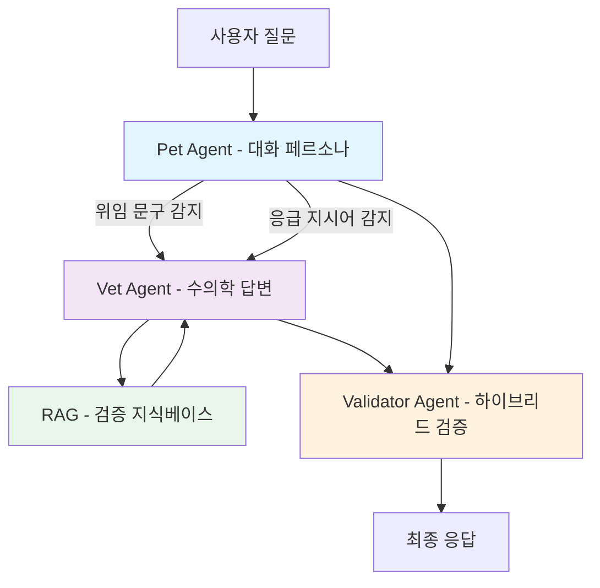
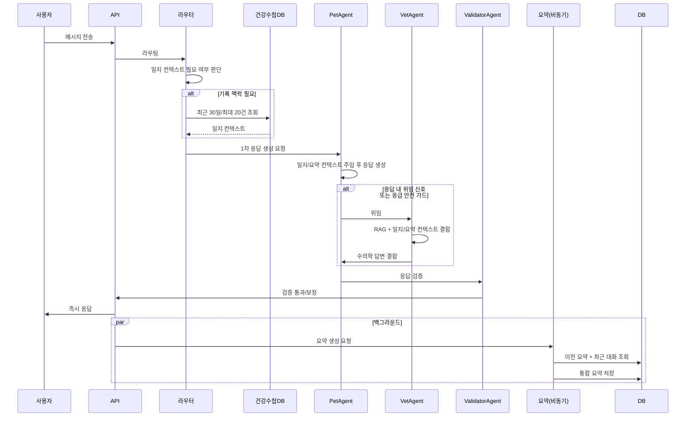

## 잡담

단순한 아이디어로 반려동물 채팅 MVP를 만든 지 벌써 3년이 지났다. ([ChatGPT 활용해 반려동물 대화 기능 만들기](/blog/chat-gpt))

AI Agent도 없던 시절이라... 반려동물 채팅 기능까지 유지보수하기는 1인 개발자로선 쉽지 않않다.

그렇게 얼마 지나지 않아 당시 연결해둔 LLM API가 종료되었고, 단일 문자열 프롬프트에 강하게 의존하던 구조는 LLM API 변경에도 쉽게 망가져버렸다.

그렇게 방치된 기능으로 2년이 흘렀다.

<!--truncate-->

### 다시 만들어보자.

서비스 문의 중에는 지금도 잊히지 않는 메시지가 있다.

> 아이와 1:1대화 더 많이 할수있게 부탁드려요. 어제 아이를 떠나보내고 슬픔에 빠져 절망스러웠는데 해당어플의 대화기능을 통해 많이 위로받았습니다. 이런 좋은기능 만들어주셔서 정말정말 감사해요. 생각지도 못한곳에서 보물을 발견한 기분이에요. 너무너무 감사합니다.

... 계속해서 유지보수하지 못해 죄송스럽다.

하지만 이번엔 AI agent라는 든든한 지원군이 있으니 바이브 코딩을 곁들여서 만들어보기로 했다.

## 단일 프롬프트에서 오케스트레이션으로

새로운 바라봄 챗은 **3-Agent 오케스트레이션**을 중심으로 동작한다.

- `PetAgent`: 보호자와 자연스럽게 대화하는 페르소나 레이어
- `VetAgent`: 실제 수의학 판단/설명 생성 레이어
- `ValidatorAgent`: 응답 안전성 점검 레이어

여기서 중요한 포인트는 역할 분리다. 의학 답변 생성 책임을 VetAgent로 분리해 정확성과 책임 경계를 명확히 했다.

## 라우팅 핵심: "질문"이 아니라 "응답"을 본다

이번 구조에서 가장 크게 달라진 점은 **응답 기반 위임**이다.

기존처럼 질문 키워드만 보고 "의학 질문인가?"를 단정하지 않는다. 먼저 PetAgent가 응답을 만들고, 그 응답 안의 위임 신호를 기준으로 Vet 위임 여부를 결정한다.

여기에 안전 가드를 추가했다.

- Pet 응답에 "수의사 선생님", "모르는 질문" 같은 위임 문구가 있으면 Vet 위임
- Pet 응답에 "응급 신고", "즉시 전화" 같은 지시가 포함되면 안전 fallback으로 Vet 위임 강제
- 짧은 후속 질문("시간은?", "그때는?")도 직전 원문/요약을 함께 읽어 해석
- "내가 방금 뭐라고 했지?" 같은 복기 질문은 직전 사용자 발화를 우선 참조

즉, 라우팅의 기준이 질문 단어 자체보다 **생성된 응답과 안전 신호**가 되었다.

## 검증 정책: 규칙 + LLM 하이브리드

ValidatorAgent는 두 층으로 동작한다.

1. 규칙 기반 검증: 빈 응답, 금지어 등 즉시 판별 가능한 조건 차단
2. LLM 기반 검증: 의미적 안전성/자연스러움 점검

여기서 중요한 건 타임아웃이 나도 "응답 없음"으로 끝내지 않는다는 점이다. 핵심 답변이나 재시도 안내를 포함한 fallback으로 사용자 경험을 지킨다.

## RAG와 요약: 정확도와 맥락을 동시에

### RAG (검증 지식베이스)

- 출처: Merck, AVMA, AAHA, WSAVA 등 권위 기관
- 검증 현황: 2026-02-09 기준 내부 검증 완료
- 기준: peer-reviewed 또는 공신력 있는 협회 출처 인용

### 건강수첩 DB 컨텍스트 (실제 기록 기반)

- 모든 질문에서 조회하지 않고, 메시지/직전 대화/요약을 함께 보고 "기록 맥락이 필요한 질문"일 때만 조회
- `건강수첩 DB`에서 **최근 30일, 최대 20건, 최신순**으로 조회해 컨텍스트 문자열로 정리
- 정리된 일지 컨텍스트를 Pet/Vet 프롬프트에 함께 주입해, "최근 어떤 증상이 있었는지" 같은 질문에 실제 기록을 반영
- 즉, 답변은 "기록 기반 참고 정보"를 강화하는 방식이며, 최종 진단/처방은 실제 수의사 진료를 전제로 한다

### Conversation Summary (비동기 롤링 요약)

- 사용자 응답과 분리된 비동기 백그라운드 요약
- 이전 요약 + 최근 5개 실제 메시지를 결합한 통합 요약
- 사용자 턴 기준 3턴마다 1회 생성(요약 스로틀링)

덕분에 긴 대화에서도 맥락이 끊기지 않고, 전체 대화 원문을 매번 넣지 않아 토큰 비용도 안정적으로 관리된다.

## 요청 처리 흐름

지속 대화 API와 단발 질문 API는 동일한 원칙을 공유한다. 사용자에게는 즉시 응답을 반환하고, 무거운 맥락 정리는 뒤에서 비동기로 처리한다.

## 마무리

확실히 AI가 발전함에 따라 서비스 개발도 한층 쉬워진 것 같지만 어느글에서 **AI의 역할은 90%까지** 라고 하더라.

나머지 10%를 채우기 위해 아직 가야 할 길은 멀지만...

적어도 올해 가을까지는 오픈하고 싶다.

## 👨‍💻🤝

바라봄 홈페이지 : [https://barabom.me](https://barabom.me)

개발자 인스타그램 : [https://www.instagram.com/right_hot](https://www.instagram.com/right_hot)
