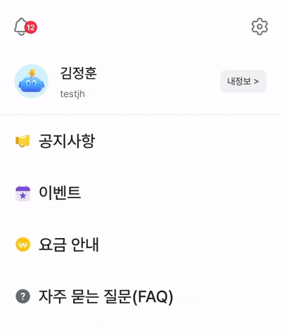
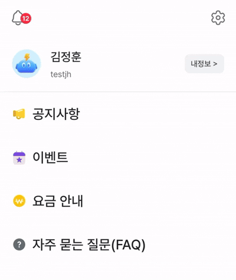

## 개인적인 일들

잡담과 변명부터 하자면, 2025년은 중대사가 많았다.

<!--truncate-->

### 신혼 집 구매

최근 3년간 부산 주례 → 부산 수영구 → 서울 신림 → 서울 신도림 → 서울 도봉구까지 이사를 많이도 다녔다.

그렇게 전·월세를 전전하다가 25년 6월에 신혼집을 구매했다.

서울 끝자락이고 나보다 나이가 많은 구축 아파트이지만 더 이상 이사를 가지 않아도 된다는 사실에 마음이 편안하다.

### 결혼

25년 10월, 10년 만난 여자친구가 아내가 되었다.

아내와 나는 10년을 만났지만 각자의 집안은 처음 만나는 사이이다. 그러다 보니 신경 쓸 게 한두 가지가 아니었다.

**결론적으론 그래서 공부 및 개인 프로젝트 할 시간이 많이 없었다.** 🫠

## 개인 사이드 프로젝트

`차세대 바라봄`은 25년 여름 오픈이 목표였는데 이 글을 쓰고 있는 지금 26년 여름이 다가오고 있다 😱

지금 운영 중인 바라봄은 주니어 시절 기획 및 개발을 하기도 했고, TypeScript가 아닌 JavaScript 기반이라 여러모로 유지보수가 어려워 리팩토링을 시작했다.

우선 UI 컴포넌트를 [ZS-ui](https://0610studio.github.io/zs-ui/docs/intro) 라는 오픈소스로 만들어 분리했다.

그리고 디자인 시스템을 구축하고 체계적으로 바라봄을 제로 베이스로 다시 만들었다.

하다 보니 백엔드도 Node Express에 JS를 사용하고 있어서 Kotlin SpringBoot로 리팩토링을 같이 진행했다.

처음에는 불필요한 리팩토링이 아닌가 했지만 AI agent가 나온 지금 꽤 잘한 선택이었다는 생각이 든다.

강타입 언어의 장점으로 AI agent가 코드를 더 잘 이해할 수 있어 작업이 점점 수월해지고 있다.

지금 마무리 작업 진행 중이니 26년 여름전엔 오픈할 수 있을 것 같다.

## 직장에서

직장에서는 앱의 프론트엔드를 담당하면서 신규 기능 개발부터 CI/CD 자동화, 플랫폼 업그레이드까지 다양한 작업을 했다. 

단순히 앱 운영 작업보다 **개발 환경과 코드 품질을 개선하는 작업**에 시간을 많이 썼던 한 해였다.

그중에서도 가장 큰 작업은 단연 **React Native 0.70에서 Expo 53으로의 마이그레이션**이었다.

### 왜 Expo로 전환했나

기존 앱은 React Native 0.70 기반의 bare workflow로 운영되고 있었다. 2022년에 릴리즈된 버전이라 벌써 3년이나 된 레거시였다.

- **스토어 SDK 요구사항**  
  Google Play는 2025년 8월 31일부터 신규 앱 및 업데이트 시 Android 15 (API level 35) 타겟팅을 의무화했다. 이걸 맞추지 못하면 아예 스토어에 앱을 올릴 수가 없다. Apple도 마찬가지로 2025년 4월부터 Xcode 16과 iOS 18 SDK로 빌드한 앱만 App Store Connect에 업로드할 수 있게 됐다.

- **라이브러리 호환성 문제**  
  새로운 라이브러리를 도입하려고 하면 React Native 버전이 낮아서 설치가 안 되는 경우가 많았다.

- **RN core 업그레이드 문제**  
  React Native 공식에서 제공하는 **Upgrade Helper**라는 도구가 있다. 현재 버전과 타겟 버전 사이에 변경된 네이티브 코드를 diff로 보여주는 도구인데, 이론적으로는 이걸 따라가면 버전 업그레이드가 가능하다.
  그런데 문제는 앱의 네이티브 코드가 **너무 많이 커스터마이징되어 있었다**는 거다. 인수인계 받을 시점부터 운영하는 3년 동안 여러 라이브러리를 추가하고, 네이티브 모듈을 직접 작성하고, 빌드 설정을 수정하면서 ios/와 android/ 폴더가 상당히 복잡해져 있었다. Upgrade Helper가 보여주는 diff를 그대로 적용할 수 있는 상태가 아니었다.

  실제로 RN core 업그레이드를 시도해봤는데, **충돌나는 부분이 너무 많았다.** Podfile 설정, Gradle 설정, Info.plist, AndroidManifest.xml... 하나하나 수동으로 머지해야 했고, 그 과정에서 어떤 설정이 왜 들어갔는지 파악이 안 되는 것들도 많았다. 히스토리를 모르는 레거시 네이티브 코드를 건드리는 건 생각보다 리스크가 컸다.

  결국 **기존 프로젝트를 업그레이드하는 것보다 새 프로젝트를 만들어서 소스 코드를 옮기는 게 낫겠다**는 결론에 도달했다. 어차피 새로 시작할 거라면, bare workflow를 유지할 이유도 없었다. 네이티브 폴더를 직접 관리하지 않아도 되는 Expo managed workflow가 장기적으로 유지보수 비용을 줄여줄 거라고 판단했다.

### Expo를 선택한 이유

**EAS Build와 Development Build** 를 사용해 네이티브 모듈도 자유롭게 추가할 수 있고, **Expo Modules API**로 네이티브 코드도 직접 작성할 수 있다.

결정적으로 **EAS Build의 클라우드 빌드 환경**이 매력적이었다. 로컬에서 Xcode 버전 맞추고 CocoaPods 캐시 지우고 하는 삽질 없이, 그냥 커맨드 한 줄이면 빌드가 된다. CI/CD 파이프라인 구축도 훨씬 간단해진다.

### 결과

마이그레이션 과정에서 expo 호환 문제, 최신 네이티브 SDK 적용 문제, Yoga 엔진의 렌더링 변경에 의한 레이아웃 틀어짐 등.. 문제도 많았고
개발앱과 운영앱이 번들과 패키지가 완전히 분리되어 운영되고 있어 설정 문제도 처음에는 쉽지 않았다.

하지만 마이그레이션 후 느낀 건, **개발자 경험이 확실히 좋아졌다**는 거다. 
GitHub Actions와 EAS Build 덕분에 빌드 및 배포에 신경 쓰지 않아도 되고, 시간도 많이 절약되어 비즈니스에 더 집중할 수 있게되었다.

## 그 외

- **ReactQeury 개선**  
  이전에도 ReactQeury를 사용하고 있었지만 **말그대로 사용만** 하고 있었다.
  <s>변명이지만</s> 사이드 이펙트 때문에 건드리지 못하고 있었던 캐싱 최적화와 사용성 개선 작업을 조금 진행했다. (아직 점진적으로 진행중이다..)
   
| Before | After |
|--------|-------|
|  |  |

- **GA4 설정 및 고도화**  
  점점 데이터가 더 중요해지는 시대인 것 같다. GA4를 사용해 이벤트 추적을 강화했고, 직접 보고서를 생성해 다른 팀에 제공했다.
  25년 연말쯤에는 대 Agent 시대가 오면서 **GA4 MCP와 연동해 월별 보고서를 에이전트가 직접 만드는 시스템**도 구성했다.

- **FE 컨벤션**  
  팀 내 프론트엔드 컨벤션을 상세하게 정의하고 적용했다. ESLint, Prettier부터 시작해 네이밍 및 아키텍처적인 부분까지.
  몇몇 컨벤션은 비즈니스 영향도가 있어 조심스럽게 순차적으로 진행했고, 글을 쓰는 지금 대부분 마무리되었다.

- **앱 보안**  
  앱 보안 검사를 받아봤다. 큰 문제는 없었지만 몇몇 문제가 있어 React Native의 빌드 방식 및 OTA 방식에 대해 좀 더 깊게 공부했다.
  **jadx**를 사용해 APK를 디컴파일해서 bundle파일을 찾고 바이트코드를 **hermes-doc**사용해 디컴파일해서 **jsbundle**까지 확인해봤다. 어떻게 보면 평생 모를 수도 있었을텐데 좋은 기회를 만나 구조에 대한 이해도가 높아진 것 같다.
  
- **E2E 테스트**  
  E2E 테스트 도구로 Appium을 사용하다가 [Maestro](https://docs.maestro.dev/platform-support/react-native)로 변경했다. 성능과 DX, 모든 면에서 아주 만족한다.

 

# 또 잡담

이틀 동안 내가 쓴 블로그 글과 커밋 내역으로 AI agent에게 "나"처럼 글을 작성하라고 AI를 갈궈봤다. 하지만 아직까지는 AI가 만족할 만큼 "나"를 표현하지는 못하더라.

아직은 내가 쓰는 게 "나" 다운 것 같다.