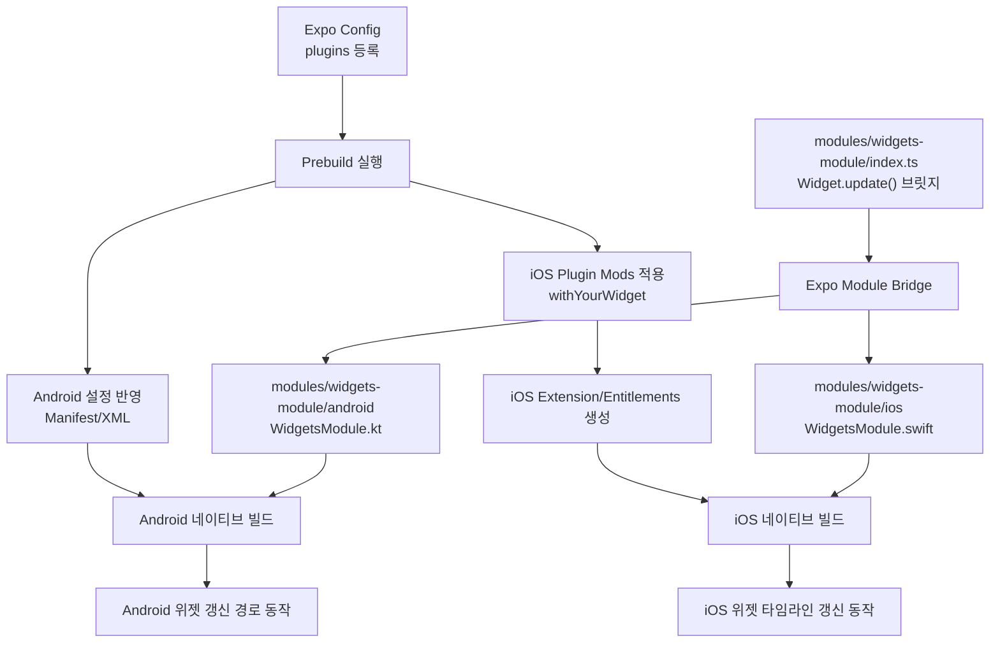
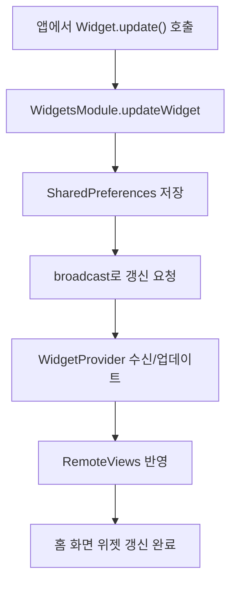
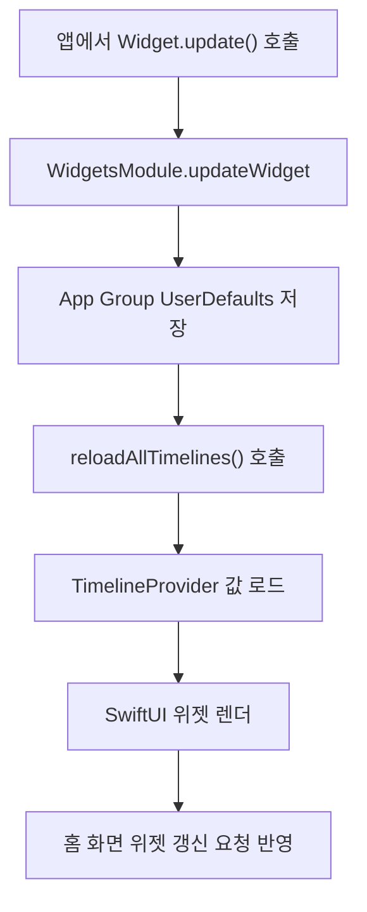

Expo 프로젝트에 위젯 기능을 적용하는 방법을 정리한 글이다.

[Expo SDK 55](https://expo.dev/changelog/sdk-55)에서 `expo-widgets` iOS alpha가 공개되었지만,
Android까지 포함한 커스텀 구성이나 상세 제어가 필요하면 이런 방식이 여전히 유효하다.

<!--truncate-->

## 요약

먼저 전체 흐름만 짧게 보면 아래와 같다.

- 네이티브 위젯 구성 요소(Android `AppWidgetProvider`/`XML`, iOS `Widget Extension`)를 EXPO 프로젝트에 포함시켜야한다.
- Android는 `modules/widgets-module/android`의 네이티브 모듈을 기준으로 `Manifest`/`XML`/`레이아웃`을 연결하고, prebuild 이후 네이티브 빌드에서 위젯 업데이트 경로를 묶는다.
- iOS는 `plugins/withYourWidget`가 prebuild에서 Extension 타겟과 권한 파일을 생성한 뒤, `modules/widgets-module/ios`의 Swift 모듈이 App Group 저장과 타임라인 갱신 호출을 담당한다.
- 앱 레벨에서는 `modules/widgets-module/index.ts`의 `Widget.update()` 브릿지를 호출하고, 이 호출이 Android/iOS 네이티브 모듈로 전달되어 동일한 API로 플랫폼별 위젯 갱신 과정을 실행한다.



## Expo Modules 생성

[여기](https://docs.expo.dev/modules/get-started/)를 참고해서 Expo Modules를 추가한다.

```bash
npx create-expo-module@latest --local
```

## Android 위젯

Android 홈 화면 위젯을 구성하기 위한 네이티브 설정과 브리지 연결 과정을 순서대로 정리한다.

### 1) Android 네이티브 위젯 모듈

위젯 동작에 필요한 Android 네이티브 파일과 구성 요소를 먼저 정의한다.

먼저 살펴볼 파일은 아래 두 개다.

- `modules/widgets-module/android/.../widget/WidgetsModule.kt`
- `modules/widgets-module/android/.../widget/WidgetProvider.kt`

#### 1-1. Manifest 등록

위젯 리시버를 시스템에 등록해서 업데이트 이벤트를 받을 수 있도록 설정한다.

```xml
<receiver
  android:name=".WidgetProvider"
  android:exported="true">
  <intent-filter>
    <action android:name="android.appwidget.action.APPWIDGET_UPDATE" />
    <action android:name="com.your.package.widget.UPDATE" />
  </intent-filter>
  <meta-data
    android:name="android.appwidget.provider"
    android:resource="@xml/widget_info" />
</receiver>
```

#### 1-2. Widget Provider XML

위젯의 크기, 초기 레이아웃, 표시 위치 등 메타 정보를 XML로 선언한다.

- `android/src/main/res/xml/widget_info.xml`

```xml
<appwidget-provider
  xmlns:android="http://schemas.android.com/apk/res/android"
  android:minWidth="250dp"
  android:minHeight="100dp"
  android:initialLayout="@layout/widget_view"
  android:widgetCategory="home_screen" />
```

#### 1-3. 위젯 레이아웃

실제 홈 화면에 표시될 위젯 UI 레이아웃과 기본 텍스트 영역을 정의한다.

- `android/src/main/res/layout/widget_view.xml`

```xml
<LinearLayout xmlns:android="http://schemas.android.com/apk/res/android"
  android:layout_width="match_parent"
  android:layout_height="match_parent"
  android:padding="12dp">

  <TextView
    android:id="@+id/widget_title"
    android:layout_width="match_parent"
    android:layout_height="wrap_content"
    android:text="@string/widget_default_title"
    android:textStyle="bold" />

</LinearLayout>
```

#### 1-4. 네이티브 모듈 구현

Expo에서 호출할 네이티브 함수와 위젯 갱신 로직을 Kotlin 코드로 구현한다.

- `android/src/main/java/.../WidgetsModule.kt`

```kotlin
class WidgetsModule : Module() {
  companion object {
    internal const val PREFS_NAME = "com.your.package.widget.prefs"
    internal const val KEY_TITLE = "widget_title"

    fun requestWidgetUpdate(context: Context, widgetProviderClass: Class<*>) {
      val appWidgetManager = AppWidgetManager.getInstance(context)
      val componentName = ComponentName(context, widgetProviderClass)
      val appWidgetIds = appWidgetManager.getAppWidgetIds(componentName)
      val intent = Intent(context, widgetProviderClass).apply {
        action = AppWidgetManager.ACTION_APPWIDGET_UPDATE
        putExtra(AppWidgetManager.EXTRA_APPWIDGET_IDS, appWidgetIds)
      }
      context.sendBroadcast(intent)
    }
  }

  override fun definition() = ModuleDefinition {
    Name("WidgetsModule")

    AsyncFunction("updateWidget") { options: Map<String, Any?> ->
      val title = options["title"] as? String
      val widgetClassName = options["widgetClassName"] as? String

      val prefs = requireNotNull(appContext.reactContext)
        .getSharedPreferences(PREFS_NAME, Context.MODE_PRIVATE)
      prefs.edit().putString(KEY_TITLE, title).apply()

      val widgetClass = Class.forName(widgetClassName ?: "com.your.package.widget.WidgetProvider")
      requestWidgetUpdate(requireNotNull(appContext.reactContext), widgetClass)

      mapOf("success" to true)
    }
  }
}
```

- **requestWidgetUpdate**
  1. `AppWidgetManager.getInstance(context)`로 시스템 위젯 매니저를 가져온다.
  2. `ComponentName(context, widgetProviderClass)`로 어떤 Provider를 갱신할지 식별한다.
  3. `getAppWidgetIds(componentName)`로 현재 홈 화면에 배치된 해당 위젯 인스턴스 ID 목록을 조회한다.
  4. `Intent(...).apply { ... }`에 `ACTION_APPWIDGET_UPDATE`와 `EXTRA_APPWIDGET_IDS`를 넣어 업데이트 요청 페이로드를 만든다.
  5. `context.sendBroadcast(intent)`로 브로드캐스트를 보내면 `WidgetProvider.onReceive`가 수신하고, `appWidgetIds`가 비어있지 않으면 `onUpdate`가 호출된다.

- **definition()**
  1. `ModuleDefinition` 안에서 `Name("WidgetsModule")`을 선언해 JS에서 접근할 모듈 이름을 고정한다.
  2. `AsyncFunction("updateWidget")`이 Expo/JS에서 직접 호출하는 진입점이 된다.
  3. `options`에서 `title`, `widgetClassName`을 꺼내고, `widgetClassName`이 없으면 기본 Provider 경로를 사용한다.
  4. `appContext.reactContext`로 `SharedPreferences(PREFS_NAME)`를 열어 `KEY_TITLE` 값을 저장한다.
  5. `Class.forName(...)`으로 Provider 클래스를 동적으로 찾고 `requestWidgetUpdate(...)`를 호출해 갱신을 트리거한다.

여기까지가 Android 구성이다.

## iOS 위젯

### 1) iOS 네이티브 위젯 확장 타겟

iOS 위젯은 Android와 달리 Widget Extension 타겟을 함께 구성해야 하므로, 네이티브 생성이 필요하다.

#### 1-1. app.config.ts에 config plugin 등록

iOS는 런타임 코드만으로 Widget Extension 타겟을 만들 수 없기 때문에, Expo Managed 워크플로우에서는 prebuild 시점에 실행되는 config plugin 등록을 한다.

```ts
export default {
  expo: {
    plugins: ["./plugins/withYourWidget"],
  },
};
```

#### 1-2. withYourWidget.js가 필요한 이유와 실행 시점

`plugins/withYourWidget.js`는 iOS 위젯 생성 체인을 자동화한다.

iOS에서 plugin이 필요한 이유는, Android처럼 Manifest/리시버만 연결해서 끝나는 구조가 아니기 때문이다.

즉, **Widget Extension 타겟/파일/entitlements를 Xcode 프로젝트에 일관되게 반영해야 한다.**

#### 1-3. 빌드에 적용되는 방식

`withYourWidget.js`는 "런타임에 앱에서 호출되는 파일"이 아니라, **네이티브 프로젝트 생성 단계에서 실행되는 빌드 입력**이다.

1. `app.config.ts`의 `expo.plugins`에 `"./plugins/withYourWidget"`를 등록한다.
2. `npx expo prebuild --platform ios`를 실행하면 Expo가 app config를 평가하면서 plugin JS를 실행한다.
3. plugin 내부의 iOS mods가 `ios/` 프로젝트 파일을 수정해 Widget Extension 타겟, `Info.plist`, `.entitlements`, Swift 소스 등을 생성/주입한다.
4. 생성된 결과가 Xcode 프로젝트에 포함된 상태로 `xcodebuild`가 실행되고, 이때 메인 앱 + Widget Extension이 함께 서명/컴파일된다.

인증서/프로비저닝의 최종 유효성 확인은 Apple 개발자 설정과 빌드 환경에서 별도로 필요하다.

- `plugins/withYourWidget.js`

```js
const WIDGET_TARGET_NAME = "YourWidget";

function getAppGroupId(bundleIdentifier) {
  return `group.${bundleIdentifier}.widget`;
}

function getWidgetBundleId(bundleIdentifier) {
  return `${bundleIdentifier}.${WIDGET_TARGET_NAME}`;
}

function generateWidgetSwiftCode(appGroupId) {
  return `import WidgetKit
import SwiftUI

struct SimpleProvider: TimelineProvider {
  func placeholder(in context: Context) -> SimpleEntry { SimpleEntry(date: Date(), title: "Your App") }
  func getSnapshot(in context: Context, completion: @escaping (SimpleEntry) -> Void) {
    completion(SimpleEntry(date: Date(), title: loadTitle()))
  }
  func getTimeline(in context: Context, completion: @escaping (Timeline<SimpleEntry>) -> Void) {
    let entry = SimpleEntry(date: Date(), title: loadTitle())
    completion(Timeline(entries: [entry], policy: .after(Date().addingTimeInterval(900))))
  }

  private func loadTitle() -> String {
    let defaults = UserDefaults(suiteName: "${appGroupId}")
    return defaults?.string(forKey: "widget_title") ?? "Your App"
  }
}

struct SimpleEntry: TimelineEntry {
  let date: Date
  let title: String
}

struct YourWidget: Widget {
  let kind: String = "YourWidget"
  var body: some WidgetConfiguration {
    StaticConfiguration(kind: kind, provider: SimpleProvider()) { entry in
      Text(entry.title)
    }
    .supportedFamilies([.systemSmall, .systemMedium])
  }
}`;
}

function generateWidgetInfoPlist() {
  return `<?xml version="1.0" encoding="UTF-8"?>
<plist version="1.0"><dict>
  <key>NSExtension</key>
  <dict><key>NSExtensionPointIdentifier</key><string>com.apple.widgetkit-extension</string></dict>
</dict></plist>`;
}

function generateWidgetEntitlements(appGroupId) {
  return `<?xml version="1.0" encoding="UTF-8"?>
<plist version="1.0"><dict>
  <key>com.apple.security.application-groups</key>
  <array><string>${appGroupId}</string></array>
</dict></plist>`;
}
```

### 2) iOS 네이티브 위젯 모듈

Expo에서 호출할 네이티브 함수는 App Group 저장소에 데이터를 쓰고 `WidgetCenter`로 타임라인 갱신을 요청한다.

`WidgetCenter.shared.reloadAllTimelines()`는 즉시 반영을 보장하는 API가 아니라, 시스템에 타임라인 재로드를 요청하는 API다.
실제 위젯 반영 시점은 시스템 스케줄링과 예산 정책에 따라 달라질 수 있다.

- `modules/widgets-module/ios/WidgetsModule.swift`

```swift
import ExpoModulesCore
import WidgetKit

public class WidgetsModule: Module {
  private static let KEY_TITLE = "widget_title"

  public func definition() -> ModuleDefinition {
    Name("WidgetsModule")

    AsyncFunction("updateWidget") { (options: [String: Any]) -> [String: Any] in
      let title = options["title"] as? String

      Self.updateWidgetData(title: title)
      Self.reloadWidgetTimelines()

      return ["success": true]
    }
  }

  private static func getSharedUserDefaults() -> UserDefaults? {
    UserDefaults(suiteName: "group.com.your.package.widget")
  }

  private static func updateWidgetData(title: String?) {
    guard let userDefaults = getSharedUserDefaults() else { return }
    if let title = title {
      userDefaults.set(title, forKey: KEY_TITLE)
    }
  }

  private static func reloadWidgetTimelines() {
    if #available(iOS 14.0, *) {
      WidgetCenter.shared.reloadAllTimelines()
    }
  }
}
```

여기까지 하면 플랫폼별 네이티브 준비가 끝난다.

이제 공통 TypeScript 브릿지에서 `Widget.update()` 한 가지 API로 두 플랫폼을 묶는다.

## 공통 모듈

### 1) 브릿지

네이티브 모듈 메서드를 TypeScript로 감싸 앱 코드에서 쉽게 호출할 수 있게 만든다.

- `modules/widgets-module/index.ts`

```ts
import ExpoWidgetsModule from "./src/WidgetsModule";

export const DEFAULT_WIDGET_CLASS = "com.your.package.widget.WidgetProvider";

export const Widget = {
  async update(title: string) {
    return ExpoWidgetsModule.updateWidget({
      title,
      widgetClassName: DEFAULT_WIDGET_CLASS,
    });
  },
};
```

### 2) Expo에서 사용

앱 화면에서 브릿지 함수를 호출해 위젯 텍스트를 실제로 업데이트하는 사용 예시를 작성한다.

```tsx
import { useState } from "react";
import { Button, View } from "react-native";
import { Widget } from "@/modules/widgets-module";

export default function TestWidgetScreen() {
  const updateWidgetTitle = (title) => {
    Widget.update(title);
  };

  return (
    <View>
      <Button
        title="widget_title 업데이트"
        onPress={() => {
          updateWidgetTitle("위젯 제목 변경");
        }}
      />
    </View>
  );
}
```

### 3) 데이터 전달 흐름

앱에서 `Widget.update()`를 호출하면 플랫폼별로 흐름은 아래처럼 나뉜다.

#### Android



#### iOS



### 4) Android와 iOS 차이점

iOS에서 `plugins/withYourWidget.js`가 필요한 핵심 차이는 "생성 단계"에 있다.

| 항목 | Android | iOS |
| --- | --- | --- |
| 위젯 구성 단위 | `AppWidgetProvider` + XML | `Widget Extension` + SwiftUI |
| 초기 설정 방식 | Manifest/XML/Module 작성 | Widget Extension 타겟 + entitlements 구성 (signing/provisioning은 EAS credentials 단계) |
| Expo에서 핵심 작업 | 네이티브 모듈 연결 후 브로드캐스트 갱신 | `withYourWidget.js`로 prebuild 시점에 타겟/파일/권한 자동 생성 |
| 공유 저장소 | `SharedPreferences` | App Group `UserDefaults(suiteName:)` |
| 갱신 트리거 | `AppWidgetManager` broadcast | `WidgetCenter.reloadAllTimelines()` |

- Android는 이미 존재하는 앱 타겟 안에서 Provider를 등록하고 데이터를 갱신하는 흐름이 중심이다.
- iOS는 Widget Extension이라는 별도 타겟을 추가해야 하므로, 파일 생성 + Xcode 프로젝트 수정 + entitlements 연결을 자동화하는 plugin이 필요하다.
- 그래서 iOS는 "앱 코드 구현" 이전에 `withYourWidget.js` 기반 prebuild 생성 체인이 먼저 정상 동작해야 한다.

## 정리

- 앱 코드에서는 `Widget.update()` 단일 API를 호출한다.
- Android는 `SharedPreferences` + `AppWidgetManager` broadcast로 갱신한다.
- iOS는 App Group `UserDefaults` + `WidgetCenter.reloadAllTimelines()`로 타임라인 재로드를 요청한다.
