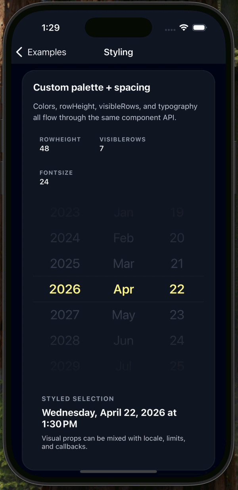

`@0610studio/expo-skia-date-wheel-picker`를 만들었다.

Expo / React Native에서 사용할 수 있는 날짜/시간 휠 피커이고, 이름 그대로 Skia를 사용했다.

GitHub: [0610studio/expo-skia-date-wheel-picker](https://github.com/0610studio/expo-skia-date-wheel-picker)

<!--truncate-->

## 왜 만들었나

사실 처음부터 날짜 피커를 만들 생각은 없었다.

바라봄을 다시 만들면서 날짜나 시간을 입력하는 화면이 많아졌고, 당연히 이미 있는 라이브러리를 쓰면 되겠다고 생각했다.

그런데 막상 적용해보니 원하는 느낌이 잘 나오지 않았다.

가장 불편했던 건 **휠이 완전히 멈춘 뒤에야 값이 바뀌는 딜레이**였다.

사용자는 이미 원하는 날짜로 휠을 움직였는데, 앱의 상태는 휠이 idle 상태가 될 때까지 한 박자 늦게 따라오는 느낌이었다. 짧은 딜레이지만 입력 화면에서는 꽤 거슬렸다.

또 하나는 스타일링이었다. 앱마다 폰트와 타이포그래피가 다른데, 기존 피커는 폰트 조정이 어렵거나 제한적인 경우가 많았다.

바라봄은 디자인 시스템을 따로 분리해서 쓰고 있었기 때문에, 날짜 피커만 시스템 폰트와 기본 스타일로 튀는 게 마음에 들지 않았다.

결국 필요한 건 아래 정도였다.

- 스크롤 중에도 선택값이 바로 업데이트될 것
- 폰트, 색상, row 높이 같은 시각 요소를 조정할 수 있을 것
- 날짜와 시간을 같은 방식으로 다룰 수 있을 것
- Expo 환경에서 설치와 사용이 복잡하지 않을 것

그래서 그냥 직접 만들어보기로 했다.

## Skia를 사용한 이유

Skia를 사용한 가장 큰 이유는 **렌더링 프레임 드롭** 때문이었다.

휠 피커는 단순해 보이지만 실제로는 계속 스크롤 이벤트가 발생하고, 스크롤되는 row 위에 가운데 선택 영역과 위아래 fade overlay를 고정해서 얹는 UI다.

처음에는 React Native View만으로 처리해도 되지 않을까 생각했는데, 오버레이와 가이드 라인까지 모두 View로 겹쳐서 만들면 스크롤 중에 미묘하게 버벅이는 순간이 있었다.

날짜 입력 UI는 대단한 애니메이션이 필요한 영역은 아니지만, 손가락으로 직접 밀고 있는 순간에 프레임이 떨어지면 바로 티가 난다.

그래서 휠의 row 자체는 React Native `ScrollView`와 `Text`로 유지하고, 시각적으로 덮는 fade overlay와 선택 영역 guide line만 Skia로 그렸다.

즉, 모든 것을 Skia로 다시 그린 건 아니다.

```tsx
<Canvas style={StyleSheet.absoluteFill}>
  <Rect x={0} y={0} width={wheelWidth} height={overlayHeight}>
    <LinearGradient
      start={vec(0, 0)}
      end={vec(0, overlayHeight)}
      colors={[backgroundColor, transparentBackgroundColor]}
    />
  </Rect>

  <Line
    p1={vec(0, topGuideY)}
    p2={vec(wheelWidth, topGuideY)}
    color={guideColor}
    strokeWidth={1}
  />
</Canvas>
```

이렇게 나누니 터치/스크롤은 React Native의 기본 동작을 그대로 사용하면서, 시각적인 부분만 Skia로 안정적으로 처리할 수 있었다.

## onDateChange는 idle을 기다리지 않는다

이번 피커에서 가장 중요하게 본 부분은 `onDateChange` 타이밍이다.

기존에 불편했던 지점이 "휠을 움직였는데 값은 늦게 바뀌는 것"이었기 때문에, 이 피커는 가운데 row가 바뀌면 스크롤 중에도 바로 `onDateChange`를 호출하도록 만들었다.


```tsx
<DateWheelPicker
  date={date}
  mode="time"
  minuteInterval={10}
  onDateChange={setDate}
  onStateChange={setPickerState}
/>
```

`onStateChange`는 별도로 `spinning` / `idle` 상태를 알려준다.

값 변경과 휠 상태를 분리하고 싶었다. 값은 즉시 동기화하되, 저장 버튼 활성화나 로딩 표시 같은 부가 처리는 상태를 보고 조정할 수 있게 한 것이다.

내부에서는 `ScrollView`의 offset을 row 높이로 나눠 현재 가운데에 가까운 index를 계산한다.

```ts
const nextIndex = getClampedIndex(
  Math.round(offsetY / rowHeight),
  options.length,
);
```

그리고 같은 값이 반복해서 나가지 않도록 마지막으로 emit한 값을 기억한다.

별거 아닌 것 같지만, 이 부분이 없으면 스크롤 중 같은 값으로 `onDateChange`가 너무 많이 호출된다.

## react-native-date-picker와 비슷하게 사용하도록 했다

기존에는 [`react-native-date-picker`](https://github.com/henninghall/react-native-date-picker)를 사용하고 있었다.

이미 프로젝트 안에서 날짜 피커를 쓰는 방식이 어느 정도 정해져 있었기 때문에, 새로 만든다고 해서 사용법까지 완전히 바꾸고 싶지는 않았다.

그래서 API는 기존에 사용하던 `react-native-date-picker`의 inline controlled API와 최대한 비슷한 느낌으로 잡았다. `date`를 넘기고, 값이 바뀌면 `onDateChange`로 받는 형태다.

```tsx
import { useState } from 'react';
import DateWheelPicker from '@0610studio/expo-skia-date-wheel-picker';

export default function Example() {
  const [date, setDate] = useState(new Date('2026-04-22T13:30:00'));

  return (
    <DateWheelPicker
      date={date}
      mode="date"
      onDateChange={setDate}
    />
  );
}
```

사용하는 쪽에서는 기존 피커를 교체하더라도 `date`와 `onDateChange` 중심으로 이해할 수 있게 하고 싶었다.

지원하는 기능은 아래 정도다.

- `date` 모드: `year / month / day`
- `time` 모드: `hour / minute`, 12시간제일 때 `AM/PM`
- `minimumDate` / `maximumDate` 제한
- `minuteInterval` 분 단위 스냅
- `locale` 기반 라벨과 12/24시간 처리
- `timeZoneOffsetInMinutes`를 통한 타임존 기준 편집

처음에는 timezone까지 넣을까 말까 고민했는데, 실제 앱에서는 저장된 Date와 사용자에게 보여주는 시간이 달라지는 경우가 있어서 포함했다.

API가 조금 늘어나더라도 날짜/시간 입력 컴포넌트에서 timezone을 외부에서 억지로 보정하는 것보다는 낫다고 판단했다.

## 스타일링

이번에 직접 만든 이유 중 하나가 폰트 조정이었기 때문에, 스타일링 prop은 처음부터 넣었다.



```tsx
  <DateWheelPicker
    date={date}
    mode="date"
    onDateChange={setDate}
    backgroundColor="#111827"
    activeFontColor="#fef08a"
    disableFontColor="#64748b"
    fontSize={24}
    fontFamily="Pretendard"
    rowHeight={48}
    visibleRows={7}
  />
```

`fontSize`, `fontFamily`, `rowHeight`, `visibleRows`를 조정할 수 있게 했고, `visibleRows`는 짝수가 들어오면 가운데 row를 유지하기 위해 홀수로 정규화한다.

`backgroundColor`는 단순히 View 배경색만 바꾸는 게 아니라 Skia overlay의 gradient 색상에도 같이 사용한다.

이런 작은 부분을 맞춰야 컴포넌트가 앱 안에서 따로 노는 느낌이 덜하다.

## Expo 패키지로 만들기

패키지는 Expo 환경에서 설치와 사용이 크게 복잡하지 않도록 만들었다.

```bash
npx expo install @shopify/react-native-skia expo-haptics
```

예제 앱은 `expo-router`로 구성했고, 아래 케이스를 따로 확인할 수 있게 했다.

- 기본 date 모드
- time 모드와 `minuteInterval`
- `minimumDate` / `maximumDate`
- locale / timezone
- styling
- callback 확인

라이브러리를 만들 때 예제 앱을 같이 만드는 게 귀찮긴 한데, 결국 내가 제일 많이 보게 된다.

문서보다 예제 화면에서 바로 돌려보는 게 훨씬 빠르다.
